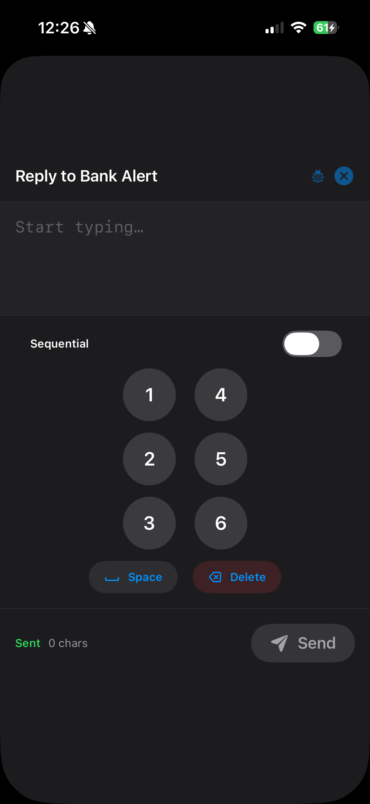
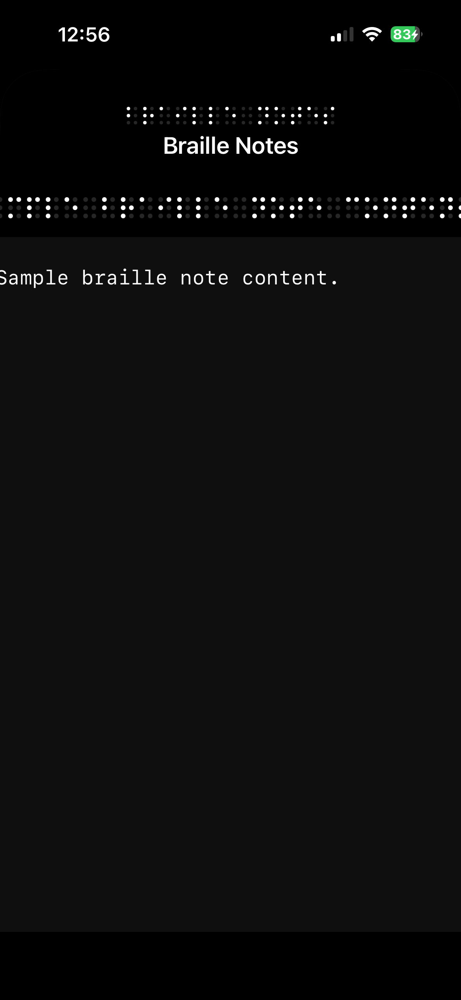
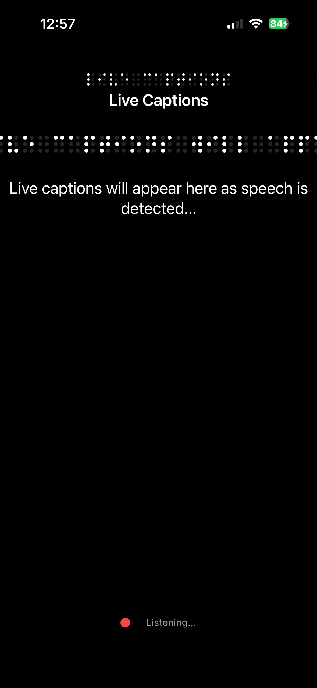
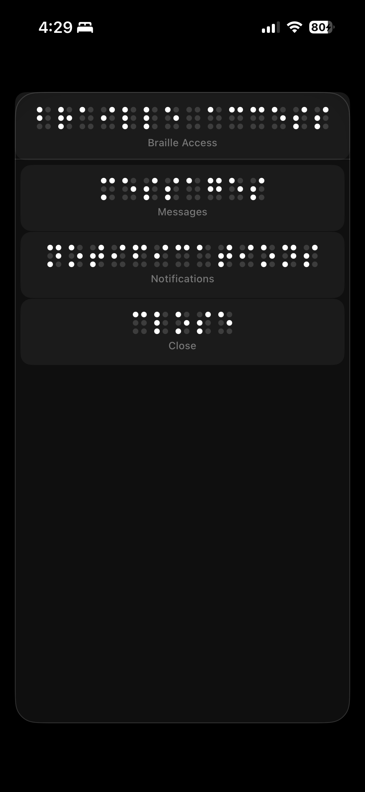
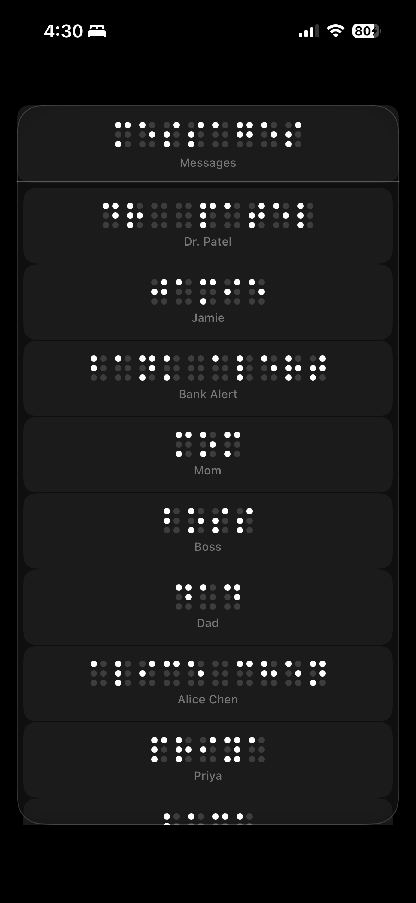
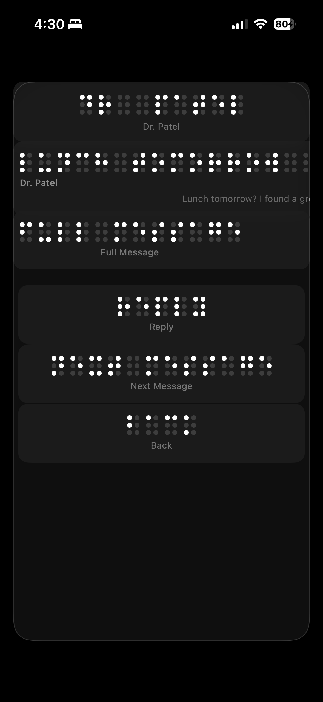
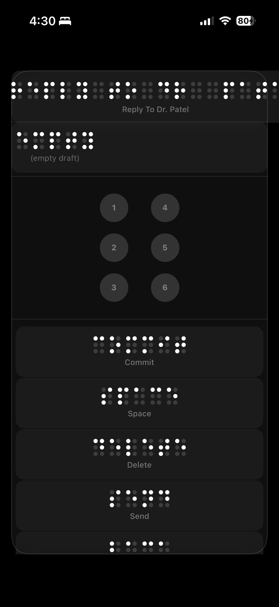
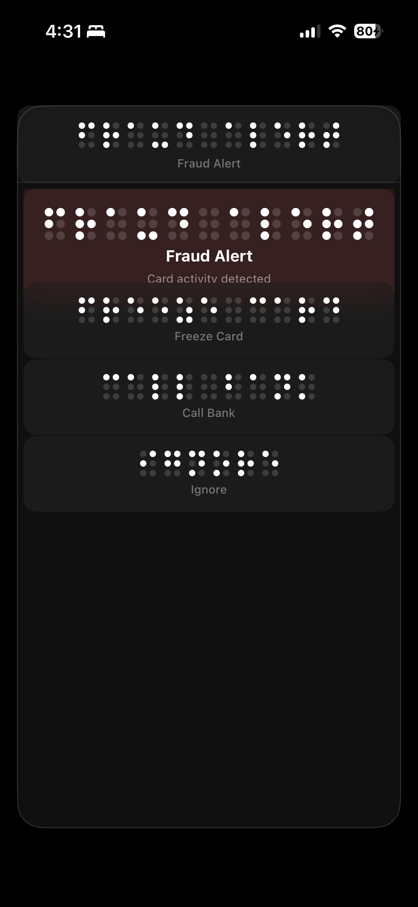

# Braille Technology

**The Post-Visual Operating System.**

Braille Technology is an AI-powered tactile interface that converts structured digital meaning into haptic intelligence. It replaces visual screens with a braille-dominant interaction layer where every gesture, every notification, and every reply is driven entirely by touch — no vision or hearing required.

Built for deafblind users. Designed for everyone.

---
<div align="center">
  
  
  
  
  
  <br />
  
  
  
  
</div>

## The World in 7–10 Years

Digital environments are becoming exponentially denser. AI-generated content is accelerating the volume of information every person must process daily. Notifications compound. Feeds multiply. Inboxes overflow.

Within the next decade:

- AI agents will generate more messages than humans do.
- Average daily notification counts will double or triple.
- Attention fragmentation will become a clinical-scale health concern.
- Blind, deafblind, and neurodiverse users will face structural exclusion from systems designed around visual consumption.
- Even sighted users will reach cognitive saturation — the point where more screen time produces less comprehension.

The response cannot be bigger screens, louder alerts, or faster scrolling. The response must be a fundamentally different relationship between humans and information.

**Braille Technology is not an accessibility feature.**
**It is a post-visual operating paradigm.**

It proposes that the future of human–device interaction is not visual at all. It is tactile, semantic, and compressed — an interface that delivers *meaning* through the body, not *pixels* through the eyes.

---

## The Problem

Today's accessibility tools translate overload. They do not solve it. VoiceOver reads content linearly — every word, every label, every notification — producing a serial stream that mirrors the visual clutter it was meant to bypass. External braille displays require dedicated hardware costing thousands of dollars. Information architecture across every major platform is built for sighted consumption: spatial layouts, color hierarchies, icon grids. None of this transfers to sensory-diverse users.

Deafblind users face the sharpest edge of this failure. When a fraud alert arrives, they cannot hear a ringtone. They cannot see a banner. They cannot scan a screen. They must depend on another person to tell them what happened, what it means, and what to do — surrendering autonomy at the exact moment it matters most.

The deeper problem is that meaning is still encoded visually.

---

## AI as the Core Engine

Braille Technology does not use AI as decoration. AI is the core translation layer between raw digital information and tactile comprehension.

Without AI, Braille Technology would simply vibrate text.
With AI, it translates meaning into tactile intelligence.

The AI layer is responsible for:

- **Semantic compression** — Distilling a 200-word email into a 120-character tactile summary that preserves intent, urgency, and emotional tone.
- **Urgency modeling** — Scoring every message against a priority framework so the user's attention is directed to what matters, not what arrived most recently.
- **Emotional tone detection** — Classifying sender emotion (neutral, anger, joy, fear, sadness) so the haptic signature of a message reflects how it *feels*, not just what it says.
- **Personal prioritization learning** — Adapting compression depth and alert thresholds to the individual user's patterns over time.
- **Adaptive depth control** — Offering summary-first interaction with on-demand expansion to full content, controlled entirely by gesture.
- **Cognitive load awareness** — Monitoring interaction pace and notification density to prevent overload before it happens.

All processing is on-device. No raw message content leaves the phone. The user controls compression depth at every stage. Privacy is not a feature — it is the architecture.

---

## What It Does

Braille Technology provides a complete messaging workflow through tactile interaction:

```
Home → Messages → Pick Conversation → Read Message → Reply → Type with Braille Keyboard → Send
Home → Messages → Pick "Bank Alert" → Fraud Alert Room → Freeze Card / Call Bank / Ignore
```

The entire flow is operable without looking at the screen. Braille dots are the primary UI; English text labels are secondary and can be hidden entirely via Judge Mode.

### Core User Flow

1. **Home** — Three action rows: Messages, Notifications, Close
2. **Conversations** — List of message senders (Mom, Boss, Bank Alert, etc.); selecting **Bank Alert** opens a fraud response room
3. **Read** — Message summary in braille, full message reading via long-press, reply/next/back actions
4. **Compose** — 6-dot braille keyboard, draft display, commit/space/delete/send/back actions
5. **Send** — Success clears draft and returns to conversation; failure preserves draft with error haptic

### Interaction Model

| Gesture | Action |
|---|---|
| **Single tap** on a row | Preview (short haptic + moves focus) |
| **Double tap** on a row | Activate (open/navigate/send; Bank Alert opens fraud response room) |
| **Drag horizontally** across braille dots | Continuous tactile reading — each character produces a unique dot-pattern burst |
| **Swipe up/down** | Change focused row |
| **Swipe down** | Go back |
| **Long press** on full message | Stream full message as sequential braille haptics |

### Haptic Language

Braille Technology uses a structured haptic vocabulary — not generic vibrations, but a tactile language where every event has a distinct physical signature:

- **Focus changed** — boundary bump when moving between rows
- **Preview** — single short vibration confirming the focused row
- **Activate** — distinct "enter" pattern on navigation
- **Send success** — strong confirmation pulse
- **Send failure** — segmented error pulse
- **Tactile reading** — per-character dot-pattern bursts. Each braille cell fires a unique sequence: one pulse per raised dot, scanned left column then right column, with intensity varying by dot position (top row sharp, bottom row soft). "a" feels like a single tap. "l" feels like a descending cascade. Spaces produce silence. Every character has a tactile fingerprint.

---

## Demo Scenarios

### Scenario A — The Fraud Alert

Imagine you are deafblind.

Your phone vibrates. A fraud alert has arrived — someone is attempting a transaction on your account. Time matters. You cannot see the notification banner. You cannot hear the alert tone. You cannot ask someone nearby to read it for you because you are alone.

With Braille Technology:

1. You feel the urgency-weighted haptic signature — sharper, faster than a normal message.
2. You open Messages, move to **Bank Alert**, and double-tap.
3. A dedicated fraud response room appears with three actions: **Freeze Card**, **Call Bank**, **Ignore**.
4. You double-tap **Freeze Card** (or **Call Bank**) and feel immediate confirmation.
5. You close the room and return to normal home navigation.

Detection → comprehension → decision → action → confirmation. No sight. No sound. No dependency on another human.

### Scenario B — Mom's Birthday

A gentler moment. Mom texted about dinner plans. Dad followed up with a reminder. A bank statement and a work agenda also arrived.

Braille Technology compresses the noise. Mom's message surfaces first — warm tone, personal category. You read the summary, reply *"yes 7pm"*, and move on. The bank statement waits. The work agenda waits. Nothing interrupts.

You chose what mattered. The system respected that choice.

### Scenario C — Overload Filter

Fifteen messages arrived overnight. Meeting confirmations, newsletter digests, group chat noise. None of them are urgent.

Braille Technology's compression layer has already scored and categorized every one. You skim the conversation list through braille. You feel the difference — low-urgency messages have lighter haptic weight. You skip them in seconds and put the phone down.

The system absorbed the overload so you didn't have to.

---

## Deep Apple Ecosystem Integration

Braille Technology is not a standalone app. It is designed as a sensory operating layer that deepens with every Apple device it touches.

### iPhone — The Primary Tactile Surface

- **Core Haptics** — Full CHHapticEngine integration for precise, patterned haptic rendering. Each braille character maps to a unique haptic burst with per-dot intensity and timing. Fallback to UIImpactFeedbackGenerator on devices without Core Haptics.
- **Multi-touch gesture engine** — Single tap, double tap, horizontal drag, vertical swipe, and long press — all with debounce logic to prevent conflicts. The entire interface is gesture-only; no buttons required.
- **Apple Intelligence** — On-device semantic compression powered by Apple's native ML frameworks. Message classification, urgency scoring, tone detection, and summary generation run locally. No data leaves the device.

### Apple Watch — Micro-Haptic Urgency Layer

- Silent, wrist-level urgency alerts that escalate based on message priority.
- A deafblind user receives a subtle tap for routine messages — and a sharp, repeated pulse for fraud alerts or emergency contacts.
- Stress-aware escalation: if the user has been receiving high-density notifications, the Watch dampens non-critical alerts automatically.

### HealthKit — Cognitive Health Integration (Expansion Path)

- Monitor notification-induced stress patterns over time.
- Track cognitive overload trends: how many messages per hour, how often the user engages in deep reading, how frequently urgency alerts fire.
- Surface burnout warnings before they become crises.
- Provide weekly sensory health summaries — a new category of personal health data that no platform tracks today.

Braille Technology evolves into a cross-device sensory operating layer — a unified tactile intelligence surface spanning wrist, hand, and future spatial devices.

---

## Cognitive & Sensory Health Impact

Braille Technology is not only an interface. It is a cognitive health intervention.

Every notification demands a decision. Every decision costs attention. The cumulative cost — across hundreds of daily interruptions — produces measurable cognitive fatigue, elevated stress, and reduced capacity for deep thought. For deafblind users, this cost is compounded by the additional labor of translating every visual signal into something they can perceive.

Braille Technology reduces that cost structurally:

- **Reduces digital burnout** — Semantic compression means the user processes meaning, not volume. A 15-message inbox becomes 3 tactile summaries.
- **Reduces notification anxiety** — Urgency modeling ensures only truly important messages demand immediate attention. Everything else waits.
- **Lowers cognitive fatigue** — Gesture-driven depth control (summary → full → reply) means the user expends effort only when they choose to.
- **Improves autonomy for deafblind communities** — Independent message reading, composition, and sending without sighted assistance.
- **Creates inclusive-by-design architecture** — The system works for everyone. Sighted users benefit from the same compression and prioritization.

### Measurable Impact Goals

| Metric | Target |
|---|---|
| Time from urgent message arrival to user action | < 30 seconds (vs. minutes with current tools) |
| Steps to read and reply to a message | 5 gestures (vs. 15+ with VoiceOver + keyboard) |
| Cognitive scroll depth (messages processed before fatigue) | 3x improvement through compression |

---

## Architecture

```
Sources/SenseLayer/
├── Models/          Message, BrailleCell, SenseMode, Tone, MessageCategory, DemoScenario
├── Services/        CompressionService, DraftStore, SendService, MessageRepository, MockMessageFactory
├── State/           SenseLayerState (generic over HapticService), AppState typealias
├── Haptics/         HapticEngine protocol, CoreHapticService, TactileEngine (pattern-burst haptics)
├── Utilities/       BrailleMapping (6-dot bitmask↔char), Scheduler (inactivity timer)
└── Views/           BrailleAccessOverlayView, BrailleDotsView, ContentView, OverlaySubViews
```

### Key Design Decisions

- **Pure logic first, UI last.** All state transitions, draft persistence, send behavior, and braille mapping are unit-tested without any UI dependency.
- **State machine is deterministic.** `SenseLayerState` is generic over `HapticService` so tests inject a `SpyHapticService` and assert exact haptic event sequences.
- **Dependency injection throughout.** `SendService`, `Scheduler`, `HapticService`, and `MessageRepository` are all protocols with mock implementations for testing. No hardcoded dependencies.
- **Haptics only on braille dots.** The tactile engine computes the exact pixel width of rendered braille content and only fires haptics when the finger is within that area, not across the entire row.
- **Per-character tactile fingerprints.** Each braille cell's dot bitmask drives a unique burst pattern — not just intensity variation, but pulse count, timing gaps, and per-dot-position intensity — so every letter feels different under the finger.
- **Model invariants enforced.** `Message.urgencyScore` is clamped 0…1 via failable initializer + `clamped()` factory. `BrailleCell` preconditions on exactly 6 dots. Guard clauses prevent invalid state transitions.
- **Two-way braille communication.** Not just reading messages, but composing replies through a 6-dot keyboard with success/failure feedback entirely through touch.

### State Machine (`SenseMode`)

```
.home  →  .navigate(.conversations)  →  .read(ReadContext)
                                              ↕ isComposing (braille keyboard)
```

Fraud alert handling is modeled as a home-level phase (`fraudAlertPhase`) that can be triggered directly from the `Bank Alert` conversation row.

- `takeMeBack()` from compose exits compose; from read returns to conversations; from navigate returns home
- 60-second inactivity timer auto-exits and saves drafts
- Urgent messages queue silently; alert plays only on category exit

### Braille System

- **Reading:** `BrailleCellMapper` converts text to 6-dot cells. `BrailleDotsView` renders them as dot circles (raised = bright, flat = dim). Dragging across braille triggers the `TactileEngine`, which fires a distinct haptic burst for each cell — one pulse per raised dot, scanned in braille reading order, with intensity mapped to dot position.
- **Compose:** 6-dot keyboard in a 2x3 grid. Toggle dots on/off, then commit to append a character. `BrailleMapping` maps 6-dot bitmasks to Grade 1 braille (a–z). Space cells produce silence; word boundaries are felt as gaps.

---

## What This Prototype Represents

This is a software-only MVP running on a single iPhone. It does not yet raise physical braille. It does not yet connect to real SMS or iMessage APIs. It does not yet deploy a production ML model for compression.

What it does demonstrate:

- **Tactile rendering logic** — A complete haptic language where every braille character, every navigation event, and every system response has a distinct physical signature.
- **Semantic compression flow** — Message classification, urgency scoring, tone detection, and summary generation — the full pipeline from raw content to tactile meaning.
- **Two-way tactile communication** — Not just reading, but composing and sending replies through a 6-dot braille keyboard, with success and failure feedback delivered entirely through touch.
- **Deterministic state machine** — 310 unit tests proving that every transition, every edge case, and every haptic event fires exactly when it should.

What it also demonstrates:

- **Production-quality software engineering** — Clean architecture with dependency injection, generic state machines, protocol-driven services, and 310+ deterministic tests spanning 26 test files.
- **Accessibility-first design** — Every decision made with deafblind users in mind: gesture-only interaction, zero audio reliance, on-device privacy, and tactile-first feedback.
- **Testable code at scale** — The state machine is generic over `HapticService`, enabling `SpyHapticService` to capture and assert all haptic event sequences. All business logic is decoupled from UI.

This prototype is not the product. It is the proof that the product is possible — and that the paradigm it represents is inevitable.

It is the first layer of a future post-visual operating system.

---

## Building & Testing

Requires **Xcode 26** / **Swift 6.2** / **iOS 26+**.

```bash
# Build
swift build

# Run all tests (310+ deterministic tests)
swift test

# Run with coverage
swift test --enable-code-coverage
```

### Test Suite (310+ tests across 26 test files)

The architecture is designed for testability:

**Unit Test Coverage:**
- [SenseLayerStateTests.swift](Tests/SenseLayerTests/SenseLayerStateTests.swift) — 100+ tests of state machine transitions (enter/exit, navigate, read, compose, send, drafts, inactivity)
- [CompressionServiceTests.swift](Tests/SenseLayerTests/CompressionServiceTests.swift) — Category precedence, tone detection, urgency scoring, summary truncation
- [BrailleCellTests.swift](Tests/SenseLayerTests/BrailleCellTests.swift) — Bitmask round-trips, dot density calculation
- [DraftStoreTests.swift](Tests/SenseLayerTests/DraftStoreTests.swift) — Save/load/clear, isolation by conversation key
- [MessageTests.swift](Tests/SenseLayerTests/MessageTests.swift) — Model invariants, urgencyScore clamping (0…1)
- [FraudAlertTests.swift](Tests/SenseLayerTests/FraudAlertTests.swift) — Fraud alert phases (alert → frozen/calling → dismiss)

**Integration Tests:**
- [IntegrationTests.swift](Tests/SenseLayerTests/IntegrationTests.swift) — Full user journey: enter mode → navigate categories → read → reply → send → urgent queue → inactivity

**Testing Patterns:**
- **Spy pattern:** `SpyHapticService` records all played haptic events for assertion
- **Deterministic mock data:** `MockMessageFactory` uses seeded RNG for reproducible message generation
- **Test scheduler:** `TestScheduler` enables controlled advance-time for inactivity timer testing
- **Generic state machine:** `SenseLayerState<Haptics: HapticService>` allows injecting `SpyHapticService` for tests

**Test Quality Metrics:**
- ✅ All state transitions verified
- ✅ Happy path and error paths covered
- ✅ Haptic event sequences asserted
- ✅ Draft persistence across mode changes validated
- ⚠️ Gesture recognition layer ([BrailleAccessOverlayView.swift](Sources/SenseLayer/Views/BrailleAccessOverlayView.swift)) not yet unit-tested (tested via simulator)

## Known Limitations & Roadmap

### Current MVP Limitations

| Limitation | Impact | Timeline |
|---|---|---|
| Braille mapping incomplete | Numbers & punctuation map to blank; "Hey!" → "Hey " | v0.2 |
| Tone detection simple keyword-matching | Doesn't detect sarcasm or context; defaults `.calm` | v1.0 (ML) |
| Draft persistence in-memory only | Drafts lost on app restart | v0.2 |
| Message repository not file-persisted | No message history across launches | v1.0 |
| BrailleAccessOverlayView is ~1200 lines | Difficult to test; high cognitive load | v0.2 |
| Gesture logic in main view | No unit tests for tap/drag/swipe | v0.2 |
| No actual braille hardware | Testing on simulator only | Post-MVP |
| Single device (iPhone only) | No Apple Watch support yet | v1.5 |

### v0.2 Priorities (Next Release)

- [ ] **Extend BrailleMapping** — Add numbers (0–9), common punctuation (. , ? ! ' " - :), improve backspace handling
- [ ] **Refactor BrailleAccessOverlayView** — Extract gesture recognizers; separate overlay sub-views into dedicated files
- [ ] **Add file persistence** — Draft storage to `FileManager` with `.complete` file protection; lightweight message cache
- [ ] **Improve tone detection** — Add `.neutral` to `Tone` enum; increase keyword coverage; contextual weighting
- [ ] **Test gesture layer** — Add `UIViewRepresentable` unit tests for tap, drag, swipe recognition
- [ ] **Add API docstrings** — Document all public types and methods for IDE autocomplete

### v1.0 Priorities (Production Release)

- [ ] **SwiftData integration** — Full message history, advanced search, conversation threading
- [ ] **Sentiment analysis** — CoreML-based tone detection replacing keyword matching
- [ ] **User learning** — Adaptive urgency scoring based on per-user patterns
- [ ] **Accessibility audit** — QA with deafblind community; real device validation
- [ ] **Production compression** — Apple Intelligence frameworks for semantic summarization
- [ ] **Real message APIs** — iMessage, SMS, email integration (on-device processing)

### Post-MVP (Vision)

- [ ] **Apple Watch** — Wrist-level alerts, micro-haptics, stress tracking
- [ ] **HealthKit** — Cognitive health tracking, burnout prevention
- [ ] **Spatial Computing** — visionOS haptic surfaces and hand-gesture interfaces
- [ ] **Third-party APIs** — Gmail, Outlook, Slack with on-device compression
- [ ] **Multi-language support** — Braille Grade 2 contractions, multiple language standards
- [ ] **Open protocol** — Third-party developers can build haptic experiences on Braille Technology

---

## Contributing

Braille Technology is an open-source prototype. Contributions are welcome, especially from:

- **Accessibility advocates** — Deafblind users, blind developers, accessibility specialists
- **Swift engineers** — Refactor large views, improve test coverage, implement missing features
- **Haptic researchers** — Input on tactile pattern design and sensory perception
- **Documentation** — User guides, API docs, accessibility audit reports

### How to Contribute

1. **Fork & branch** from `main`
2. **Code with tests** — All new public APIs need unit tests following existing patterns
3. **Use `SpyHapticService`** — For state machine changes, assert haptic event sequences
4. **Add docstrings** — Document all public functions with purpose, parameters, behavior
5. **Keep views small** — Extract components if exceeding 500 lines
6. **Submit PR** with clear description of improvements

### Code Quality Standards for Contributors

- ✅ All public APIs have docstring comments
- ✅ New state transitions have corresponding unit tests with spy assertions
- ✅ Haptic sequences are tested (not just visually verified)
- ✅ No single view exceeds 500 lines without explicit review
- ✅ All `guard` conditions documented with clear failure reasoning
- ✅ Dependency injection used; no hardcoded service instances

---

## Reference & Documentation

| Document | Audience | Purpose |
|---|---|---|
| **README.md** (this file) | Everyone | Vision, problem statement, user experience, demo scenarios |
| **DEVELOPMENT.md** | Developers | Technical architecture, state machine, sprints, building & testing |
| **UserJourney.md** | UX designers, blind advocates | Complete deafblind user flow (persona: Alex) |
| **resultmasterplan.md** | Technical leads | Implementation roadmap and sprint breakdown |

---

In a world drowning in information,
we do not translate text into braille.
We translate meaning into sensation.

**Braille Technology: The Post-Visual Operating System.**
